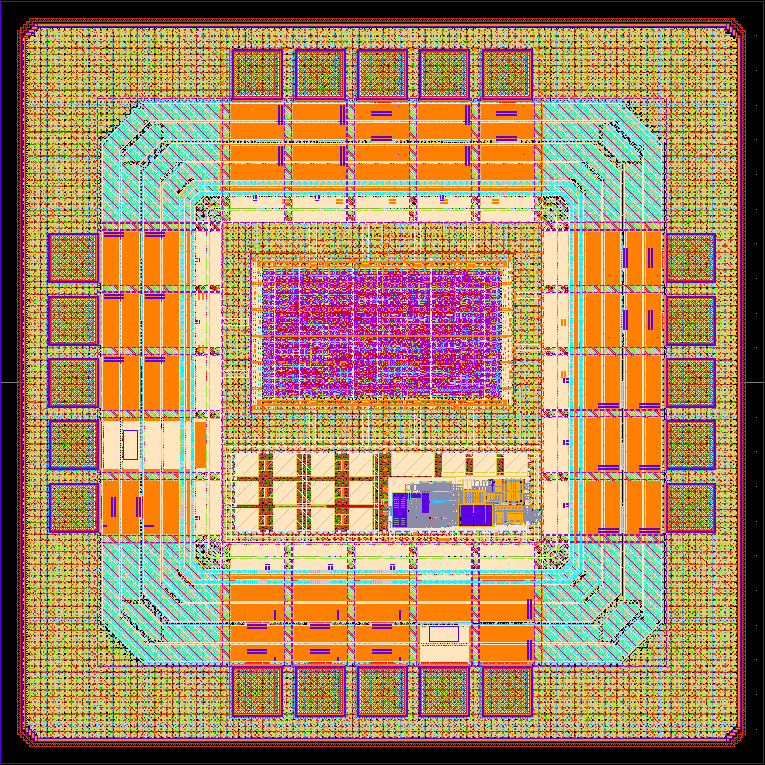

# SoC3421

Single-technology IP library.

- doc/     : user documentation
- dependencies/ : sub-cells and blocks
- release/v.1.0.0 : immutable versioned deliveries





| | |
|---|---|
| **Category** | Mixed-Signal SoC |
| **Technology** | IHP SG13CMOS |
| **Top Cell** | `SoC3421` |
| **Die Size** | 1.1 mm × 1.1 mm |
| **License** | Apache-2.0 |


## Overview


## Application


### Features


---

### Prerequisites

- [IHP SG13G2 Open PDK](https://github.com/IHP-GmbH/IHP-Open-PDK)
- [ORFS](https://github.com/the-openroad-project/openroad-flow-scripts)
- [Icarus Verilog](http://iverilog.icarus.com/)


## License

Licensed under the [Apache License 2.0](https://www.apache.org/licenses/LICENSE-2.0).

```

Licensed under the Apache License, Version 2.0 (the "License");
you may not use this file except in compliance with the License.
You may obtain a copy of the License at

    http://www.apache.org/licenses/LICENSE-2.0
```

